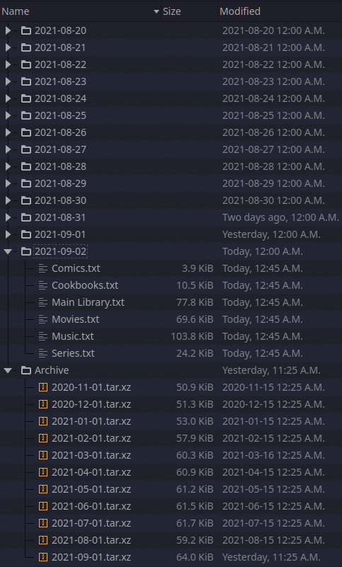

```
  _               _               _                _                     _
 | |             | |             | |              | |                   | |
 | |__  _ __ ___ | | _____ ______| |__   __ _  ___| | ___   _ _ __   ___| |__
 | '_ \| '__/ _ \| |/ / _ \______| '_ \ / _` |/ __| |/ / | | | '_ \ / __| '_ \
 | |_) | | | (_) |   <  __/      | |_) | (_| | (__|   <| |_| | |_) |\__ \ | | |
 |_.__/|_|  \___/|_|\_\___|      |_.__/ \__,_|\___|_|\_\\__,_| .__(_)___/_| |_|
                                                             | |
                                                             |_|
```
***broke-backup.sh*** was born out of necessity—sometimes you cannot afford to backup all of your data. The first thing that gets excluded from a backup is large, replaceable data such as *Linux ISOs*. :skull_and_crossbones:

This script is meant to give a little bit of security to that replaceable data by recording the directory contents using a standard Unix command: [tree](http://mama.indstate.edu/users/ice/tree/). It will output these trees to a user-defined backup folder, and will email monthly archived backups to cover catastrophic loss.

If you're unfamiliar with `tree`, don't worry; this script takes care of the most common use-cases for you. The core concept is that it recursively lists directory contents, and can be output to a text file. For advanced users, it has many custom options that can be found at its [man page](http://mama.indstate.edu/users/ice/tree/tree.1.html). 

**Disclaimer:** Despite 'backup' being in the name, this will not protect your data. This is essentially a disaster recovery assistant. If/when disaster strikes, you may lose your files, but you will know exactly *what* you lost.

#### Example Tree Output

This example is a movie folder set to a depth of 2 (list the `Movies` folder and the contents of it's direct sub-folders; `1` and `2`). In this script, this text is output to `Movies.txt`

```
/sharedfolders/DrivePool/Media/Movies
├── 1
│   ├── 10,000 BC (2008)
│   ├── 101 Dalmatians (1996)
│   ├── 101 Dalmatians II Patchs London Adventure (2003)
│   ├── 102 Dalmatians (2000)
│   ├── 10 Things I Hate About You (1999)
│   ├── 13th (2016)
│   ├── 17 Again (2009)
│   └── 1917 (2019)
├── 2
│   ├── 2001 A Space Odyssey (1968)
│   ├── 2012 (2009)
│   ├── 2036 Nexus Dawn (2017)
│   ├── 2048 Nowhere to Run (2017)
│   ├── 21 Bridges (2019)
│   ├── 21 Jump Street (2012)
│   ├── 22 Jump Street (2014)
│   ├── 24 Hour Party People (2002)
│   └── 2 Fast 2 Furious (2003)
```

*Any similarity to real films is entirely coincidental.* :upside_down_face: 

#### Example Backup Folder

This is my personal backup folder, that has been running since October 2020, as of July 2021. It backs up 6 locations—14 TiB of 40k files—into a 4.2 MiB Backup directory. A single archived backup is ~60 KiB.

It keeps 14 days of live (uncompressed) backups, and archives monthly backups indefinitely. 



### Usage

##### Dependencies:

- `tree`

- `mutt` - *must have a working configuration*

- `xz-utils`

##### Configuration

There are 7 basic config settings:

- `recipient_email` - Recipient email address

- `email_subject` - The subject for sent emails

- `monthly_email_body` - The body of the monthly email

- `forced_email_body` - The body of the forced email

- `output_dir` - Output directory for backups

- `SOURCES` - List of directories to backup 

- `DEPTH` - Depth settings for the above sources

###### Advanced Tree Settings

To accommodate advanced uses, specifying custom tree options per source is supported.
Setting `USE_CUSTOM=TRUE` will override the `DEPTH` settings of the basic config with `CUSTOM_OPTIONS`

#### Scheduling

broke-backup.sh is designed on a daily job schedule. It will also happily run less often, or purely on a manual basis.

Suggested config is to set a cron job to run the script daily. My personal config runs every day at 00:25

### Logic Overview

The script has been written to be self-documented and should be fairly easy to follow but it's overall flow is:

- **if** today's backup already exists:
  - send a forced backup email—You may want this for two reasons:
    - You've just started using broke-backup.sh and want an off-location backup before the 1st of the month rolls around
    - Testing your configuration
- **else** run today's backup to the user-defined backup folder
  - **if** today is the 1st of the month;
    - send a monthly backup email; and
    - Archive a copy into the `/Archives` sub-directory as `.tar.xz`
- Delete backups older than 2 weeks

### Current Limitations

- Two sources cannot have the same name
  
  - `/example/media/path` and `/example/cloud/path` will both output to **`path.txt`**—the second backup will overwrite the first

- File modification times of the backup will be fudged
  
  - When a backup job is finished, the directory will be backdated to 00:00 of the current day so the cleanup logic works consistently. 
